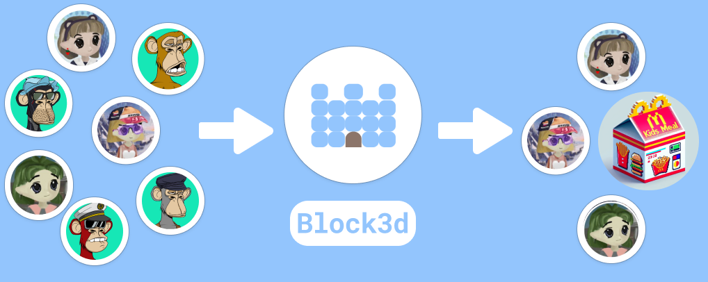

# Block3d



**block3d** is an open-source authentication toolkit designed to streamline access control within Nextjs dapps. Developers can dynamically restrict specific routes using a rule-based configuration.

This `README` contains all the necessary information needed to integrate **block3d** into your nextjs project. You may view the [full documentation here](https://block3d.gitbook.io/block3d/).

# Getting Started

Since **block3d** uses Next.js 14, it also requires Node.js 18.17 or later.

## Creating next-app

_If you already have Nextjs with app routing installed you can skip this step._

Follow the steps under the Next.js Installation section.

- If using **create-next-app**, make sure you input `Yes` when prompted: `Would you like to use App Router? (recommended) No / Yes.`
- If installing manually, ensure to follow the app routing structure.

## Installation

### NPM Package

Please note that some of **block3d**'s transitive dependencies rely on ws 8.13.0, which is a vulnerable version of ws that contains a high-level issue that has since then been [reviewed and patched](https://github.com/advisories/GHSA-3h5v-q93c-6h6q). To resolve these vulnerabilities you can set overrides in your package.json file like so:

```json
"overrides": {
    "mipd": {
      "ws": "8.17.1"
    },
    "viem": {
      "ws": "8.17.1"
    }
  }
```

**block3d** can then be installed by running this command:

```shell
npm install block3d
```

If you don't already have these installed, make sure to run this command as well:

```shell
npm install wagmi @rainbow-me/rainbowkit @tanstack/react-query viem@2.x
```

### Git Submodule

**block3d** alternatively comes in the form of a git submodule. This allows you to maintain a distinct separation of the submodule and the parent directory, as well as allowing you to fork **block3d** and directly edit it however you want.

```shell
git submodule add https://github.com/RohanNero/block3d-submodule
```

## Wrapper

The `Block3r` component lives at the app's root and wraps the entire site. It contains a `WagmiConfig`, `RainbowKitProvider`, and a `QueryClientProvider`.

### Example root

Note: Currently your root layout must have `"use client";` declared at the top of the file.

```typescript
/*  src/app/layout.tsx  */
"use client";
import { Block3r } from "block3d";
import { block3dConfig } from "../../block3d.config";
import { config } from "../../wagmi.config";

export default function RootLayout({
  children,
}: {
  children: React.ReactNode;
}) {
  return (
    <html lang="en">
      <body>
        <Block3r block3dConfig={block3dConfig} wagmiConfig={config}>
          {children}
        </Block3r>
      </body>
    </html>
  );
}

```

## Config

This section goes over the `blocked.config` file in detail. **block3d**'s behavior relies entirely on the rules inside the config, so understanding this part is important.

### Creating config

_The file's name and location can be altered._

Begin by creating a `block3d.config.ts` file at your project's root. Next, create an exported `block3dConfig` object.

```typescript
/*  block3d.config.ts  */
export const block3dConfig = {};
```

#### Configuring page restriction

Now that we have our `block3dConfig` object, we need to populate it with 3 things:

- `publicRoutes` is an array of strings representing page routes that are marked as public, meaning that any configured rules don't apply to the pages listed inside it.
- `strict` is a boolean. When marked true, all existing rule criteria must be met. When marked false, the user may view restricted pages as long as they meet the criteria for at least one rule.
- `rules` is an array of Rule objects. This is where you can control exactly which users may view your app.

```typescript
export const block3dConfig = {
publicRoutes: ["/", "/my-public-route"],
strict: false,
rules: [
    {
      title: "my-title",
      type: "simple",
      addresses: ["0xd8da6bf26964af9d7eed9e03e53415d37aa96045"],
    },
  ],
};
```

### Creating rules

The Rule type is defined like so:

```typescript
export type Rule = {
  type: string;
  title: string;
  addresses?: string[];
  minimumBal?: string;
  contracts?: Contract[];
  strict?: boolean;
};

type Contract = {
  address: string;
  chainId: number;
  minimumBal?: string;
};
```

#### `type`

There are three different types of rules:

- `simple` rules are the most basic type and allow you to essentially whitelist any set of addresses that can then view your restricted pages. These rules consist of a `title`, `type`, and `addresses` field.
- `token` rules allow you to restrict pages based on addresses that hold a `minimumBal` of any specified token. These rules consist of a `title`, `type`, `contracts`, and at least one global `minimumBal` OR at least one `minimumBal` for each `Contract` object.
- `nft` rules are identical to `token` rules except that they pertain to **ERC-721** instead of **ERC-20**.

#### `title`

This can be any arbitrary string but should be short and describe its corresponding rule since it will be exposed to users on the front end.

#### `addresses`

This is an array of Ethereum addresses in string form and is only used in simple rules.

#### `minimumBal`

This is a string representation of the minimum number of tokens/nfts that must be held by users to meet the rule criteria. Used only in token and nft rules. Remember to account for token decimals.

#### `contracts`

Used only in token and nft rules, this is an array of `Contract` objects that includes details about the token/nft smart contract.

- `address` is the smart contract address in string form. If using a chain's native currency, set this to the 0 address.
- `chainId` is the blockchain chain ID that the smart contract exists on as type number.
- `minimumBal` is the same as the `minimumBal` that lives outside of the contract object. This field exists solely to allow developers to have different minimum balances depending on the chain and isn't necessary if the other exists.

#### `strict`

Used only in token and nft rules, this behaves similarly to the `strict` field that lives directly inside the `block3dConfig` object. It is a `boolean` that when set to true, means every `Contract` inside the `contracts` array is included when deciding if a user can view the page. If set to false, a minimum of one contract must meet the rule criteria. Defaults to false.

For example, a developer using `token` rule type with `strict` set to false, could have 3 separate `Contract` objects in the `contracts` array all representing the same token but on different chains. This way users can still view your app as long as they hold the `minimumBal` on one of the chains.

### Examples

Here are predefined config files for each rule type.

#### Simple

This file is configured to block users that aren't listed in the "Open source contributors" (everyone except Vitalik).

```typescript
/*  block3d.config.ts  */
export const block3dConfig = {
  publicRoutes: ["/"],
  strict: false,
  rules: [
    {
      title: "Open source contributors",
      type: "simple",
      addresses: ["0xd8da6bf26964af9d7eed9e03e53415d37aa96045"],
    },
  ],
};
```

#### Token

This file is configured to block users that don't own 1 ETH and 500 USDC on mainnet

```typescript
/*  block3d.config.ts  */
export const block3dConfig = {
  publicRoutes: [],
  strict: true,
  rules: [
    {
      title: "Hold at least 1 ETH",
      type: "token",
      contracts: [
        {
          address: "0x0000000000000000000000000000000000000000",
          chainId: 1,
          minimumBal: "1000000000000000000",
        },
      ],
    },
    {
      title: "Hold at least 500 USDC",
      type: "token",
      contracts: [
        {
          address: "0xA0b86991c6218b36c1d19D4a2e9Eb0cE3606eB48",
          chainId: 1,
          minimumBal: "500000000",
        },
      ],
    },
  ],
};
```

#### NFT

This file is configured to block users that don't own at least 1 of these NFTs: Milady, Remelio, Bonkler.

```typescript
/*  block3d.config.ts  */
const block3dConfig = {
  publicRoutes: ["/", "/myPublicRoute"],
  strict: false,
  rules: [
    {
      title: "Own a Milady",
      type: "nft",
      contracts: [
        {
          address: "0x5Af0D9827E0c53E4799BB226655A1de152A425a5",
          chainId: 1,
          minimumBal: "1",
        },
      ],
    },
    {
      title: "Own a Remilio",
      type: "nft",
      contracts: [
        {
          address: "0xD3D9ddd0CF0A5F0BFB8f7fcEAe075DF687eAEBaB",
          chainId: 1,
          minimumBal: "1",
        },
      ],
    },
    {
      title: "Own a Bonkler",
      type: "nft",
      contracts: [
        {
          address: "0xABFaE8A54e6817F57F9De7796044E9a60e61ad67",
          chainId: 1,
          minimumBal: "1",
        },
      ],
    },
  ],
};

export default block3dConfig;
```

### Issues

If you run into any issues or have any feature requests please open an issue [here](https://github.com/RohanNero/block3d/issues).

[Pull Requests](https://github.com/RohanNero/block3d/pulls) are also welcome!
